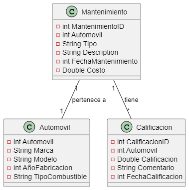

# Sistema de gestion de flota de automoviles y evaluacion  de desempeño 
Este sistema proporciona una plataforma integral para la gestion efectiva de una flotade vehiculos, abarcando una amplia gama de categorias, desde automoviles de pasajeros hasta vehiculos comerciales y ecologicos. Su objetivo principal es permitir a los admistradores realizar un mantenimiento optimo para maximizar la eficiencia operativa y la satisfaccion del cliente. 

## Caracteristicas Clave : 
* Gestion de diversidad de vehiculos: El sistema tiene una variedad de categorias de vehiculos, incluyendo automoviles de pasajeros, vehiculos comerciales, utilitarios depotyivos y vehiculos ecogolicos. esta diverisidad permite adaptarse a diferentes necesidades y preferencias de los usuarios.

* Seguimientos de rendimientos: Proporciona herrramientas para monitorear y evaluar el rendimiento de cada uno de los vehiculos en terminos de eficiencia de combustible, mantenimiento, desgastes de neumativos y mas. esto ayuda a identificar ares de mejora y optimizacion 

* Mantenimientos preventivos y correctivos : Facilita la programacion y el siguimiento del mantenimiento preventivo y correctivo de los vehiculos, incluyendo cambio de aceites, reemplazo de neumaticos,
reparaciones mecanicas, entre otros. esto ayuda a prolongar la vida util del los vehiculos y a reducir los tiempos de inactivada no planficados.

* Resgistro de calificasion y comentarios: Permite a los usuarios evaluar y comentra sobre la experiencia con cada vehiculos, lo que proporciona retroalimentacion valiosa para la calidad del servicio y la seleccion de vehiculos en la flota 

* analisis y generacion de imformes: ofrece capacidad de analizar avanzases y generar informes para extraer la informacion util sobre el rendimiento general de la flota, tendecias de mamtenimiento, satisfaccion del cliente, entre otros aspectos clave.

### RF (Requerimientos Funcionales)
* Busqueda y filtrado 
Permite a los usuairios buscar y flitrar los vehiculos pot varios criterios, marcas, modelos, año de fabricacion, tipo de combustible.

* Registros de Usuarios
Agregat la capacidad de registrar nuevos usuarios, modificar y eliminar usuarios existentes.

* Gestion de inventario:
Permite la adicion, modificar y eliminacion de vehiculos en el inventario.

* Generacion de reportes:
Capaciadad de generar informes sobre el estado el inventario, el historial de mantenimiento del auto, las calificacion de los autos.

### RNF (Requerimientos No Funcionales)

* Seguridad 
Asegurara que los datos del cliente o usuarips y los detalles de los vehiculos esten protegidos mediante autenticacion y autorizacion adecuadas.

* Escalabilidad
Diseñar el sistema de manera que pueda manejar un crecimiento fututo en la cantidad de usuarios y vehiculos sin degradar el rendimiento 

* Usabilidad 
Crear una interfaz de usuario que sea facil de usar para garantizar una experiencia agradable para los usuarios finales

## Analisis: Definicion de los Requerimentos de los autos 

* Registro de automovil 
almacena informacion sobre los vehiculos en la flota de automoviles. cada registro en esta tabla representa un automovil y contiene detallles como la marca, el modelo, el año de africacion y el tipo de conbustible de vehiculo

| AutomovilID |     Marca     | Modelo   | AñoFabricacion | TipoCombustible |
|-------------|---------------|----------|----------------|-----------------|
|     1       |  Toyota       | Corolla  |     2018       |    Gasolina     |
|     2       |  Ford         | Focus    |     2015       |    Gasolina     |
|     3       |  honda        | Civic    |     2019       |    Gasolina     |
|     4       |  Volkswagen   | Polo     |     2017       |    Gasolina     |

* Mejoramiento y Desafios:
agregar una tabla para registrar el mantenimienyo y las reparaciones de los vehiculos, incluyendo tipos,
descripcion , fechas y costos.

| MantenimientoID |    AutomovilID    |  tipo                     | Descripcion     | FechaMantenimiento |   costo   |
|-----------------|-------------------|---------------------------|-----------------|--------------------|-----------|
|     1           |       1           | Cambio de aceite          |   filtro        |   2023-05-15       |  50.00    |
|     2           |       2           | Reemplazo oneumaticos     | desgastados     |   2024-07-10       |  500.00   |
|     3           |       4           | Reemplazo motor           |falla en el motor|   2022-01-12       |  500.00   |
|     4           |       3           | Reemplazo motor           |falla en el motor|   2022-01-12       |  500.00   |

* Registro de calificaciones de los vehiculos
agregar una tabla para registrar las calificaciones y comentarios de los clientes sobre los vehiculos

| CalificacionID  |    AutomovilID    |   Calificacion   | Comentarios                  | FechaCalificacion  | 
|-----------------|-------------------|------------------|------------------------------|--------------------|
|     1           |       1           |     4.5          |   Muy buen rendimiento       |   2023-05-15       |  
|     2           |       2           |     3.8          | buen manejo y capaciadad     |   2024-07-10       |  
|     3           |       4           |     4.0          |  Hallo la solucion rapido    |   2022-01-12       |  
|     4           |       3           |     5.0          | Exelente                     |   2022-01-12       | 

## 
> Ver


> Script de la base de datos
```sql
DROP DATABASE IF EXISTS autos;
CREATE DATABASE autos;

USE autos;

create table automovil(
    AutomovilId int primary key auto_increment,
    Marca Varchar(50) ,
    modelo Varchar(50),
    AñoFabricacion float,
    TipoCombustive Nvarchar(50)
);
create table Mantenimiento (
    MantenimiendoId int primary key auto_increment,
    AutomovilId int,
    tipo NVarchar(50),
    Descripcion NVarchar(50),
    FechaMantenimiento int,
    Costo Decimal(10,2),

);
create table Calificacion (
    CalificacionId int primary key ,
    AutomovilId int,
    Calificacion Decimal(10,2),
    Comentarios NVarchar(50),
    FechaCalificacion int,
    Costo Decimal(10,2),

);```
